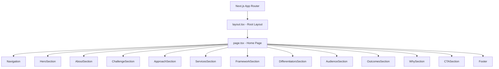
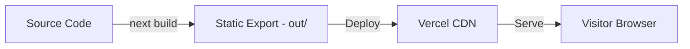

# Design Document

## Overview

Connect Collective is a single-page static marketing website built with Next.js (App Router, static export), Tailwind CSS, and deployed on Vercel. The site communicates the company's consulting value proposition through 11 content sections, a fixed navigation bar, and a footer — all within a single scrollable page.

The architecture prioritizes simplicity: one page component composed of discrete section components, styled with Tailwind utility classes, and exported as static HTML/CSS/JS with no server-side runtime. The site is fully responsive across mobile (< 768px), tablet (768px–1023px), and desktop (≥ 1024px) breakpoints.

### Key Design Decisions

- **Next.js App Router with static export** (`output: "export"` in `next.config.js`): Produces a pure static site deployable anywhere, while retaining the React component model and build-time optimizations.
- **Single `page.tsx` composing section components**: Each content section is an isolated React component, making content easy to update and test independently.
- **Tailwind CSS for all styling**: No custom CSS files needed. Responsive breakpoints (`md:`, `lg:`) and utility classes handle all layout and visual design.
- **Client-side smooth scrolling**: Navigation links use anchor hrefs with `scroll-behavior: smooth` CSS, avoiding any JavaScript scroll libraries.
- **No external runtime dependencies**: No CMS, no API calls, no database. All content is hardcoded in components.

## Architecture

### High-Level Architecture



### Project Structure

```
connect-collective/
├── public/
│   └── favicon.ico
├── src/
│   ├── app/
│   │   ├── layout.tsx          # Root layout: html, body, font, metadata
│   │   ├── page.tsx            # Home page: composes all sections
│   │   └── globals.css         # Tailwind directives + smooth scroll
│   └── components/
│       ├── Navigation.tsx      # Fixed navbar with mobile hamburger menu
│       ├── HeroSection.tsx
│       ├── AboutSection.tsx
│       ├── ChallengeSection.tsx
│       ├── ApproachSection.tsx
│       ├── ServicesSection.tsx
│       ├── FrameworkSection.tsx
│       ├── DifferentiatorsSection.tsx
│       ├── AudienceSection.tsx
│       ├── OutcomesSection.tsx
│       ├── WhySection.tsx
│       ├── CTASection.tsx
│       └── Footer.tsx
├── next.config.js
├── tailwind.config.ts
├── tsconfig.json
├── package.json
└── vercel.json
```

### Build and Deployment Flow



## Components and Interfaces

### Navigation Component

The `Navigation` component is the only stateful (client) component. All other components are server components rendered at build time.

```typescript
// src/components/Navigation.tsx
"use client";

interface NavigationProps {}

// State: mobileMenuOpen (boolean) — toggles hamburger menu visibility
// Behavior:
//   - Fixed position at top of viewport (sticky/fixed with z-index)
//   - Displays company name on the left
//   - Desktop (≥ 768px): horizontal nav links (About, Services, Framework, Let's Connect)
//   - Mobile (< 768px): hamburger icon that toggles a vertical dropdown
//   - Each link is an anchor (<a href="#section-id">) for smooth scroll
//   - Clicking a mobile menu link closes the menu
```

### Section Components

All section components follow the same pattern — they are stateless server components that render semantic HTML with Tailwind classes.

```typescript
// Generic section component pattern
interface SectionProps {
  id: string;        // Anchor ID for navigation scroll targets
  className?: string;
}

// Each section component:
// - Wraps content in <section id="..." aria-labelledby="...">
// - Uses an <h2> (or <h1> for Hero) with a consistent heading style
// - Applies responsive Tailwind classes for layout
```

#### HeroSection
- Renders: `<h1>` with company name, `<p>` with tagline, `<a>` button linking to `#contact`
- Layout: Full viewport height, centered content, prominent CTA button
- Semantic: Uses `<section>` with `aria-labelledby`

#### AboutSection
- Renders: `<h2>` heading, `<p>` with company description
- Layout: Single column, max-width constrained for readability

#### ChallengeSection
- Renders: `<h2>` heading, `<ul>` listing four overwhelm categories, `<p>` with critical question
- Layout: Single column with list items

#### ApproachSection
- Renders: `<h2>` heading, `<ul>` or card grid listing four pillars, `<p>` supplementary note
- Layout: Single column on mobile, 2-column grid on desktop

#### ServicesSection
- Renders: `<h2>` heading, four `<div>` cards each with `<h3>` title and `<p>` description
- Layout: Single column on mobile, 2×2 grid on tablet/desktop
- Visual: Cards with border/shadow for distinction

#### FrameworkSection
- Renders: `<h2>` heading, four outcome cards with emoji icon, `<h3>` title, `<p>` description
- Layout: Single column on mobile, 4-column grid on desktop
- Visual: Each card visually distinct with icon prominence

#### DifferentiatorsSection
- Renders: `<h2>` heading, four items with `<h3>` title and `<p>` description
- Layout: Single column on mobile, 2×2 grid on desktop

#### AudienceSection
- Renders: `<h2>` heading, `<ul>` listing five audience categories
- Layout: Single column, list or tag-style layout

#### OutcomesSection
- Renders: `<h2>` heading, `<ul>` listing five outcomes
- Layout: Single column with checkmark or bullet list

#### WhySection
- Renders: `<h2>` heading, `<blockquote>` or `<p>` with closing statement
- Layout: Centered, visually prominent text

#### CTASection
- Renders: `<h2>` heading, `<p>` intro message, three `<a>` links (Email, LinkedIn, Schedule)
- Layout: Centered content with distinct link buttons
- Links: `mailto:contact@connectcollective.com`, `https://linkedin.com`, `https://calendly.com`

#### Footer
- Renders: `<footer>` with `<p>` copyright text
- Layout: Full width, bottom of page

## Data Models

This is a purely static website with no dynamic data. All content is hardcoded in component files. There are no data models, APIs, or databases.

### Content Constants

Content strings (headings, descriptions, service items, framework outcomes) are defined inline within each component. If future maintainability requires it, content could be extracted to a `src/content/` directory with TypeScript objects, but this is not needed for the initial build.

### Type Definitions

```typescript
// Service item used in ServicesSection
interface ServiceItem {
  title: string;
  description: string;
}

// Framework outcome used in FrameworkSection
interface FrameworkOutcome {
  icon: string;       // Emoji character
  title: string;
  description: string;
}

// Differentiator used in DifferentiatorsSection
interface Differentiator {
  title: string;
  description: string;
}

// Contact link used in CTASection
interface ContactLink {
  label: string;
  href: string;
}
```

## Error Handling

Since this is a static site with no runtime data fetching or user input processing, error handling is minimal:

- **Build errors**: Next.js build will fail if components have TypeScript errors or invalid JSX. The CI/CD pipeline (Vercel) catches these before deployment.
- **Missing anchor targets**: Navigation links reference section IDs. If an ID is missing, the link simply won't scroll — no runtime error. This is caught by testing.
- **Broken external links**: The CTA section uses placeholder URLs. These should be validated manually before production launch.
- **Image loading**: If any images are added in the future, `alt` attributes are required by the accessibility requirements. Missing `alt` text will be caught by linting (eslint-plugin-jsx-a11y).
- **Mobile menu state**: The hamburger menu uses React state. If JavaScript fails to load, the mobile menu won't function, but all content remains visible and accessible via scrolling since it's server-rendered HTML.

## Testing Strategy

### Why Property-Based Testing Does Not Apply

This feature is a static marketing website consisting entirely of:
- UI rendering and layout (React components producing HTML)
- Static content display (hardcoded text)
- Responsive CSS behavior (Tailwind breakpoints)
- Navigation interaction (scroll behavior, menu toggle)
- Build configuration (Next.js static export)

There are no pure functions with varying input/output behavior, no data transformations, no parsers, no serializers, and no business logic. All acceptance criteria describe either content presence, visual layout, or UI interaction — none of which benefit from property-based testing. Example-based tests and snapshot tests are the appropriate strategies.

### Testing Approach

#### 1. Component Unit Tests (Jest + React Testing Library)
Verify that each section component renders the required content and semantic HTML.

- **Content presence**: Assert that required headings, text, and links are present in the rendered output
- **Semantic HTML**: Assert correct element types (`<section>`, `<nav>`, `<h1>`–`<h3>`, `<footer>`, `<main>`)
- **Heading hierarchy**: Assert heading levels follow logical order (h1 → h2 → h3)
- **Accessibility attributes**: Assert `aria-labelledby`, `alt` text, `role` attributes where needed
- **Navigation links**: Assert correct `href` values pointing to section IDs
- **CTA links**: Assert correct placeholder URLs for email, LinkedIn, and calendar
- **Keyboard navigation**: Assert interactive elements are focusable and have appropriate roles

#### 2. Responsive Layout Tests (Jest + Testing Library with viewport mocking)
- Verify hamburger menu appears below 768px breakpoint
- Verify navigation links are visible at desktop breakpoint
- Verify grid layouts apply at appropriate breakpoints (Services, Framework, Differentiators)

#### 3. Build Verification Tests
- Verify `next build` completes successfully with static export
- Verify the `out/` directory contains `index.html`
- Verify no server-side runtime dependencies in the output

#### 4. Accessibility Checks
- Run axe-core via `jest-axe` on each section component to catch common accessibility violations
- Validate color contrast ratios meet 4.5:1 minimum
- Validate heading level hierarchy

#### 5. Visual Regression (Optional, Manual)
- Manual review across mobile, tablet, and desktop viewports
- Screenshot comparison if a visual regression tool (e.g., Chromatic, Percy) is adopted later

### Test File Structure

```
src/
├── __tests__/
│   ├── components/
│   │   ├── Navigation.test.tsx
│   │   ├── HeroSection.test.tsx
│   │   ├── AboutSection.test.tsx
│   │   ├── ChallengeSection.test.tsx
│   │   ├── ApproachSection.test.tsx
│   │   ├── ServicesSection.test.tsx
│   │   ├── FrameworkSection.test.tsx
│   │   ├── DifferentiatorsSection.test.tsx
│   │   ├── AudienceSection.test.tsx
│   │   ├── OutcomesSection.test.tsx
│   │   ├── WhySection.test.tsx
│   │   ├── CTASection.test.tsx
│   │   └── Footer.test.tsx
│   └── build/
│       └── static-export.test.ts
```
